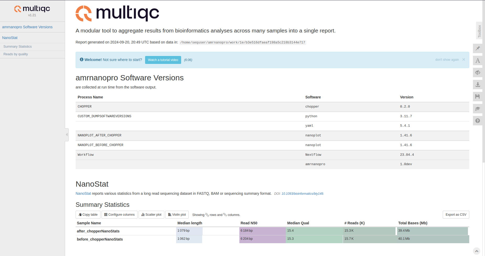

# AMRNanoPro: An Antimicrobial Resistance Analysis Pipeline for Nanopore Sequencing Data

## Introduction

AMRNanoPro is a Nextflow pipeline designed to analyze Nanopore sequencing data for antimicrobial resistance (AMR) detection in bacteria isolates whole genome sequencing data. It integrates quality control, filtering, and comprehensive reporting tools to facilitate rapid and accurate AMR profiling.  The next steps are to add Flye for assembly, medaka for polishing and Abricate for AMR profiling. At the end, the input processing will support directory and sample sheet for batch processing.
This pipeline is ideal for researchers and clinicians who need a streamlined and reproducible workflow for processing Nanopore sequencing data in the context of antimicrobial resistance studies.


## Links

- **GitHub Repository:** [AMRNanoPro](https://github.com/AlbertRockG/amrnanopro)
- **Project Blog Article:** [AMRNanoPro: A Nextflow Pipeline for Comprehensive Bacterial Genome Analysis from Quality Control to Antimicrobial Resistance Profiling](https://albertrockg.github.io/blog-post-2/)
- **Author LinkedIn:**
  - [Albert Rock A. Gangbadja](https://www.linkedin.com/in/albert-rock-gangbadja/)

## Installation

### Prerequisites

- **Nextflow** version 23.04.4 or higher
- **Java** version 11 or higher
- **Docker**

### Steps

1. **Install Dependencies:**

   - **Using Docker:**

     Ensure Docker is installed and running on your system.

2. **Download Test Data (Optional):**

   ```bash
   wget -O test_data.fastq.gz 
   ```

## Usage

To run the pipeline with your data:

```bash
nextflow run AlbertRockG/amrnanopro \
            --input_fastq path/to/your_data.fastq.gz \
            --outdir path/to/your_output_dir \
            -profile docker
```

### Parameters

- `--input_fastq`: Path to the input FASTQ file(s).
- `--skip_chopper`: Set to `false` to skip the Chopper filtering step.

### Profiles

- **`standard`**: Default execution profile.
- **`docker`**: Executes processes within Docker containers.

### Output

Results will be generated in the `results/` directory, including:

- **Quality Control Reports:**
  - Pre- and post-filtering NanoPlot reports.
- **Filtered Reads:**
  - FASTQ files after Chopper filtering.
- **MultiQC Report:**
  - An aggregated report combining all quality metrics.

## Contributing

We welcome contributions to improve AMRNanoPro! Please follow these steps:

1. **Fork the repository** on GitHub.
2. **Create a new branch** for your feature or bug fix:

   ```bash
   git checkout -b feature/your-feature-name
   ```

3. **Make your changes** and commit them with clear messages.
4. **Push to your branch**:

   ```bash
   git push origin feature/your-feature-name
   ```

5. **Create a pull request** on GitHub, describing your changes.

### Code of Conduct

Please read our [Code of Conduct](CODE_OF_CONDUCT.md) before contributing.

## Related Projects

- [Nextflow](https://www.nextflow.io/)
- [NanoPlot](https://github.com/wdecoster/NanoPlot)
- [Chopper](https://github.com/rrwick/Chopper)
- [MultiQC](https://multiqc.info/)

## License

This project is licensed under the MIT License - see the [LICENSE](LICENSE) file for details.

## Resources

- **What Your Code Repository Says About You:** [Read Article](https://blog.example.com/what-your-code-repo-says)
- **Awesome README List:** [GitHub Repository](https://github.com/matiassingers/awesome-readme)
- **Nextflow Documentation:** [Nextflow Docs](https://www.nextflow.io/docs/latest/index.html)
- **Best Practices for Writing README Files:** [Guide](https://www.makeareadme.com/)

## Screenshots

### MultiQC Report Overview



*Figure 1: MultiQC report summarizing quality control metrics.*


Thank you for using **AMRNanoPro**! If you have any questions or encounter issues, please open an [issue](https://github.com/yourusername/AMRNanoPro/issues) on GitHub.
